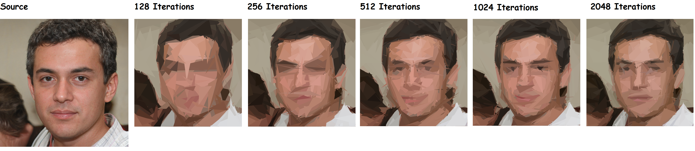

Playwright driven automation that generates stylized character portraits.

Original portraits are generated from [this-person-does-not-exist](https://this-person-does-not-exist.com/en) using AI.

Portaits are then converted to a stylized version using the amazing [Painter](https://github.com/kkestell/painter) utility created by my brother.

Painter usage:
- `Painter.exe <inputPath> <outputPath> <iterationCount> <outputDebugImages>`
- `Painter.exe C:\CharacterPortraits\Input\Person.png C:\CharacterPortraits\Output\Person.png 512 false`

